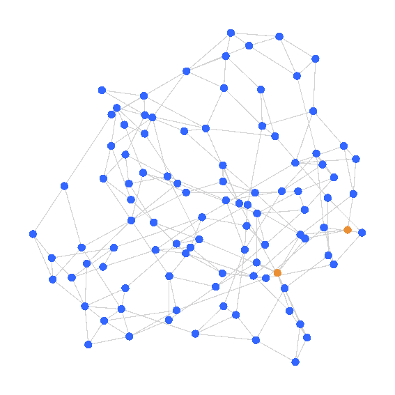
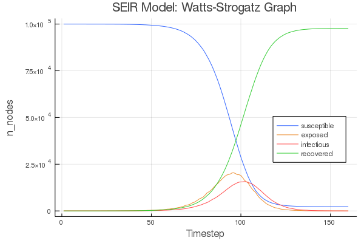
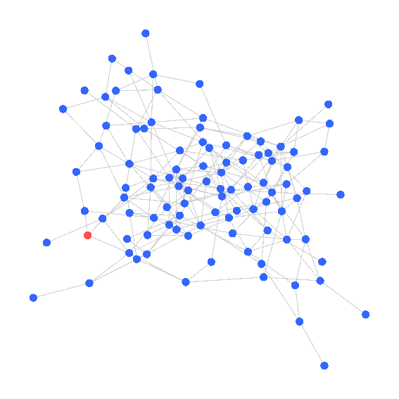
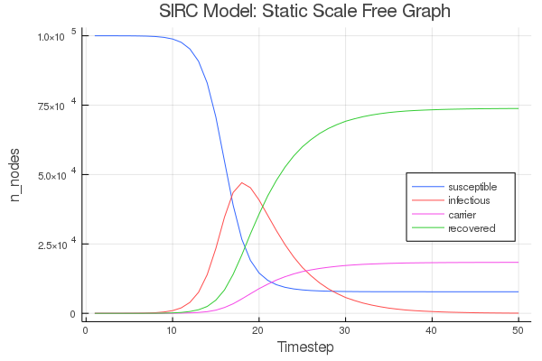

# Epidemic Simulations
Work in progress. Contains basic examples of `SIR`, `SIS`, `SEIR` and `SIRC` models on a given graph.

All of the following simulations are using an infection probability of `0.33` and a recovery probability of `0.20`. The time series plots have a much higher node count of 100k; the graph animations all have 200 nodes. SEIR and SIRC have a couple of additonal parameters.

Example running:
```julia
G = static_scale_free(200, 400, 2.5)

model = SIR()
initialise!(model, G, 80)
simulate!(model)
```

## SIR Watts-Strogatz
```julia
G = watts_strogatz(200, 4, 0.2)
```


## SIR Static Scale Free
```julia
G = static_scale_free(200, 400, 2.5)
```


## SIS Barabási-Albert
```julia
G = barabasi_albert(200, 1)
```


## SEIR Watts-Strogatz





## SIRC Static Scale Free



