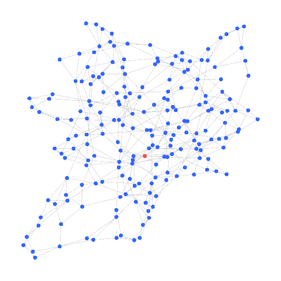
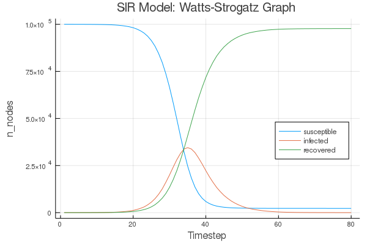
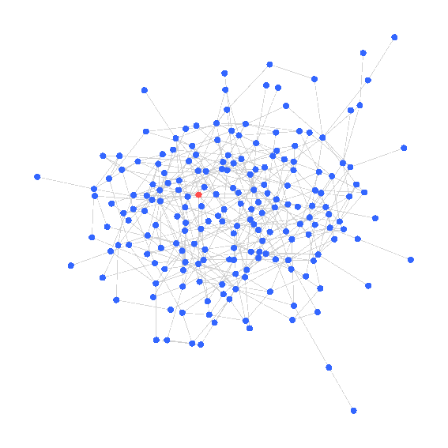
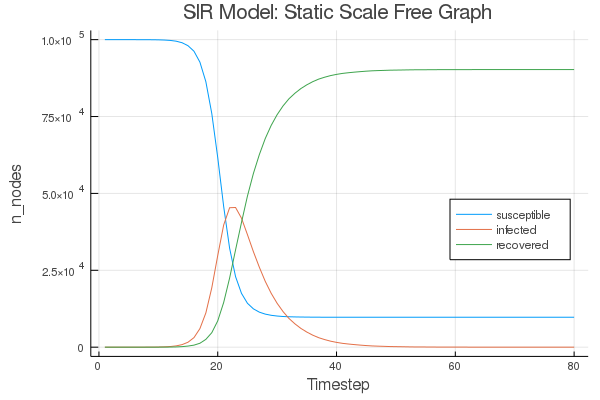
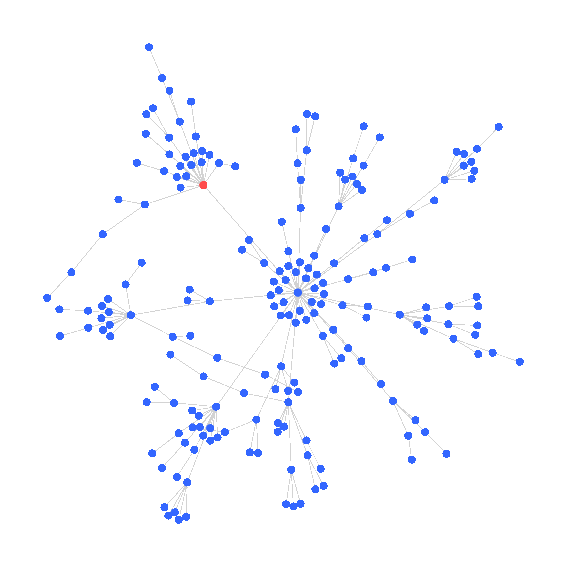
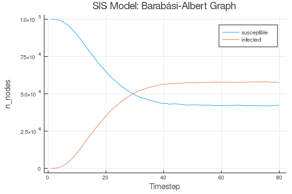

# Epidemic Simulations
Work in progress. Contains basic examples of SIR and SIS models on a given graph.

All of the following simulations are using an infection probability of `0.33` and a recovery probability of `0.20`. The time series plots have a much higher node count of 100k; the graph animations all have 200 nodes.

## SIR Watts-Strogatz
```julia
G = watts_strogatz(200, 4, 0.2)
```





## SIR Static Scale Free
```julia
G = static_scale_free(200, 400, 2.5)
```





## SIS Barabási-Albert
```julia
G = barabasi_albert(200, 1)
```



